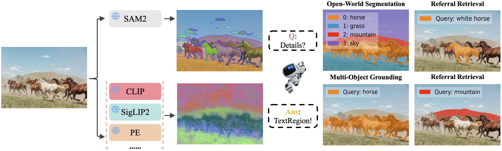

# TextRegion: Text-Aligned Region Tokens from Frozen Image-Text Models



**Authors:**: [Yao Xiao](https://avaxiao.github.io), [Qiqian Fu](https://qiqianfu.github.io), [Heyi Tao](https://scholar.google.com/citations?user=LodPihsAAAAJ&hl=en), [Yuqun Wu](https://yuqunw.github.io), [Zhen Zhu](https://zzhu.vision), [Derek Hoiem](https://dhoiem.cs.illinois.edu)  
University of Illinois at Urbana-Champaign

[](https://arxiv.org/abs/2505.23769)


## 📢 News

- **[2025-05-29]**: We dropped the paper and code for **TextRegion** — go check out the magic [here](https://arxiv.org/abs/2505.23769)!

---

## 🧠 Overview

**TextRegion** is a **training-free** framework that generates **text-aligned region tokens** by combining frozen image-text models (e.g., CLIP, SigLIP2, Perception Encoder) with segmentation masks from SAM2. These region tokens enable impressive zero-shot performance in detailed visual understanding tasks such as:

- Open-world semantic segmentation  
- Referring expression comprehension  
- Multi-object grounding  

> “A simple, general, effective, and training-free approach to create text-compatible region tokens.”

---

## 📦 Installation

```bash
git clone https://github.com/avaxiao/TextRegion.git
cd TextRegion
conda create -n TextRegion python=3.10 -y
conda activate TextRegion
bash setup_env.sh
```

## 🚀 Demo

Before run the demo, you need to download the `sam2.1_hiera_large.pt` by the link provided in [SAM2's repo](https://github.com/facebookresearch/sam2?tab=readme-ov-file#download-checkpoints). 

By configuring the `--sam2_checkpoint` and `--clip_download_root` in [`TextRegionSegmenter.py`](TextRegionSegmenter.py), you may run demo directly by:

```bash
python TextRegionSegmenter.py
```

To use a different image-text model, update the `--clip_pretrained` and `--clip_architecture` accordingly.

For inference on a custom image, edit the [`./utils/image_query_label.yaml`](./utils/image_query_label.yaml) file and set the `--image_list` to your image path.


---

## 📊 Evaluation

### 1. Open-world Semantic Segmentation

#### Preparing Data

Please follow the [MMSeg data preparation document](https://github.com/open-mmlab/mmsegmentation/blob/main/docs/en/user_guides/2_dataset_prepare.md) to download and pre-process the datasets including PASCAL VOC, PASCAL Context, Cityscapes, ADE20k, COCO Object and COCO-Stuff164k.
We provide some dataset processing scripts in the [`./process_dataset.sh`](./process_dataset.sh).

####  Evaluation

Please modify the setting `sam2_checkpoint` and `clip_download_root` in [`configs/base_config.py`](configs/base_config.py). You also need to change `data_root` in corresponding dataset configuration files in folder [`configs/cfg_ds`](configs/cfg_ds).
Then you may eval specific dataset by:

```bash
python eval_semantic.py --config ./config/cfg_ds/cfg_DATASET.py --work-dir YOUR_WORK_DIR
```

or eval on all datasets:
```bash
python eval_all_semantic.py
```
Results are listed in `YOUR_WORK_DIR`.

---

### 2. Referring Expression Comprehension

1.Download [images for RefCOCO](http://images.cocodataset.org/zips/train2014.zip), and then unzip the data using `unzip train2014.zip`. Put unzipped dataset (train2014) to `./eval/datasets/coco_rec/`.

2.Download preprocessed data files [reclip_data.tar.gz](https://huggingface.co/datasets/CresCat01/RefCOCO-Triplets/blob/main/reclip_data.tar.gz), and then extract the data using `tar -xvzf reclip_data.tar.gz`. Put extracted data to `./eval/datasets/coco_rec/`.

3.Modify `--sam2_checkpoint` and `--clip_download_root` in [`TextRegionSegmenter.py`](TextRegionSegmenter.py).

4.Run the evaluation script:
```bash
python eval_referring.py --input_file_root ./eval/datasets/coco_rec/reclip_data --image_root ./eval/datasets/coco_rec/train2014
```

---

### 3. Multi-object Grounding

1.Download [Reasoning Segmentation Test Dataset](https://github.com/dvlab-research/LISA?tab=readme-ov-file#dataset). Unzip the test.zip to `./eval/datasets/reason_seg/`.

2.Download the interpreted query file [test.tar.gz](https://drive.google.com/drive/folders/1-UPLNhPQR-IQ1ex-ySf64sd1ONBFUHCc?usp=share_link), and then extract the data using `tar -xvzf test.tar.gz` and put it to `./eval/datasets/reason_seg/interpreted_llava_v15_7b/`.

3.Modify `--sam2_checkpoint` and `--clip_download_root` in [`TextRegionSegmenter.py`](TextRegionSegmenter.py).

4.Run the evaluation script:
```bash
python eval_reason_seg.py --dataset_dir ./eval/datasets --interpreted_query_dir ./eval/datasets/reason_seg/interpreted_llava_v15_7b/test
```

---


## 📈 Citation

If you find **TextRegion** useful, please consider citing:

```bibtex
@misc{xiao2025textregiontextalignedregiontokens,
      title={TextRegion: Text-Aligned Region Tokens from Frozen Image-Text Models}, 
      author={Yao Xiao and Qiqian Fu and Heyi Tao and Yuqun Wu and Zhen Zhu and Derek Hoiem},
      year={2025},
      eprint={2505.23769},
      archivePrefix={arXiv},
      primaryClass={cs.CV},
      url={https://arxiv.org/abs/2505.23769}, 
}
```

---

## 📝 Acknowledgements

This work is built upon [SAM2](https://github.com/facebookresearch/sam2), [Trident](https://github.com/YuHengsss/Trident), [SCLIP](https://github.com/wangf3014/SCLIP), [OpenCLIP](https://github.com/mlfoundations/open_clip), [ReCLIP](https://github.com/allenai/reclip) and [LISA](https://github.com/dvlab-research/LISA). Thanks for their excellent works.

### License
This project is licensed under the [Apache License 2.0](LICENSE).